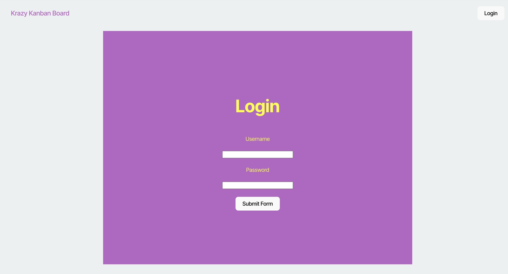
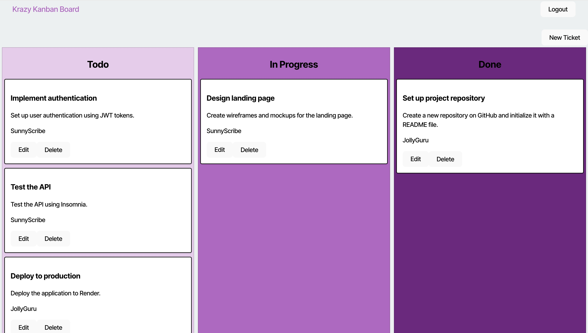
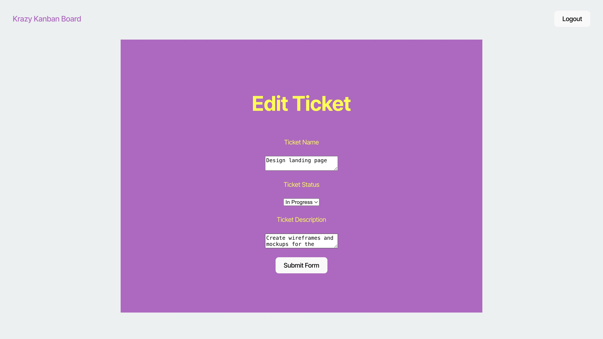
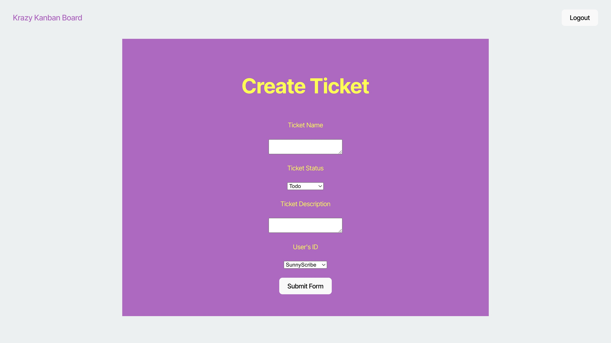

# Kanban Board

This application is very usefull and can help you and a team to manage a project. The different users can create, edit and delete tickets.

## Usage

Deployed: 

On thi application there is a login with a username and password. After the login on the home screen there it will be the way to manage many task like deleting a ticket, editing a ticket or creating a new ticket.

- Delete by pressing the delete button on the ticket
- Edit by pressing the button edit on the ticket to modify any of the information.
- Create a new ticket by pressing the button of New Tciket on the home screen
- Logout from the homescreen to the login page by clicking on the logout button on the homscreen.

## Questions

GitHub: [Nattan Aguia Trujillo](https://github.com/nattanaguiat)

If you have additional questions, please contact me by email at [nattan23@msn.com](nattan23@msn.com)
